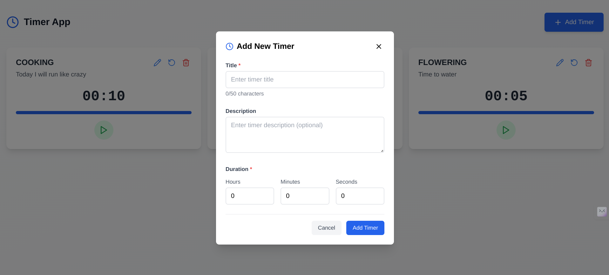

# TIMER  
## CODEWALNUT ASSIGNMENT
Introducing **Timer**, a versatile time management application designed to keep you on track and boost productivity. Whether you're managing workouts, cooking, studying, or simply tracking tasks, **Timer** provides customizable countdowns, alarms, and notifications, ensuring precision and ease. Simplify time management and achieve your goals with this intuitive and user-friendly interface!

## FEATURES OF THE APPLICATION

- Simple and intuitive application.
- Multiple timers can run at the same time.
- Proper modularized and reusable code.
- Responsive design for both web and mobile users.
- Customizable timer sound effects.
- Timers are stored using `localstorage`.

## FUTURE IMPLEMENTATIONS
- Unit and component testing using `vitest`,

## TECHNOLOGICAL STACK FOR THE APPLICATION

- `Frontend` : ReactJs, TailwindCss
- `State Management` : Redux, zustand

### RUNNING THE PROJECT LOCALLY 

Clone the repository:
   ```
   https://github.com/SUVAJIT-KARMAKAR/TIMER-CODEWALNUT.git
   ```
Navigate to the directory: 
   ```
   cd TIMER
   ```
Download all the dependencies using a package manager : 
   ```
   npm install
   ```
Run the project using the run command : 
   ```
   npm run dev
   ```

## APPLICATION SCREENSHOTS
Here are some application screenshots : 
```
Desktop : Home Screen
```


```
Desktop : Add New Timer Form 
```



```
Desktop : Editing an existing timer 
```


```
Desktop : Snack Notification 
```


```
Desktop : Form validations 
```


```
Mobile : Home Screen
```


```
Mobile : Add New Timer Form 
```


```
Mobile : Editing an existing timer 
```


```
Mobile : Snack Notification 
```


```
Mobile : Form validations 
```


## DEPLOYMENT 
This application is deployed in the Vercel, here is the live link : 

https://timerwalnut.vercel.app/